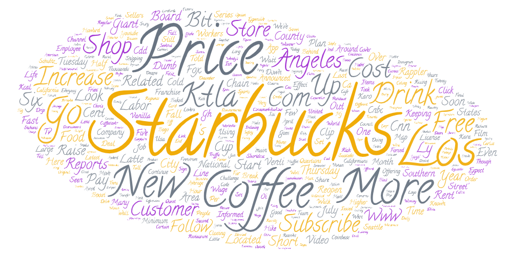
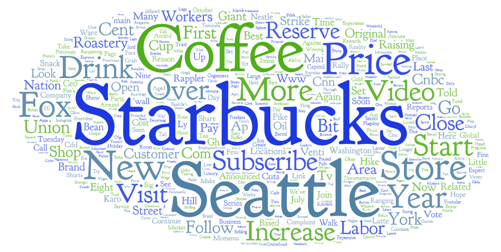

# lab2_Web_data_collection_and_visualization

## Narrative Research

i. The topic I  chosen is revolves around analyzing the potential economic impact of Starbucks' price increase. For the places I chose to research 
I chose is three cities: Los Angeles, New York, and Seattle.The search words I chose to research were "econonmic impact" and "price increase" because I felt this two words procided the best search terms base my reserch.  Also, these terms work well together to help in my investigation of the relationship between the cause (price increase) and the result (economic impact).  It enables me to look into how adjustments to a major player's pricing approach, such as Starbucks, can affect the economic dynamics of particular cities.

### ii. Make this Comparison

I want to make this comparison because in my past class I took, I did a reseach project how coffee shop will effect the global economic.  Also it helps us see how price decisions made by a multinational corporation can have disparate effects on local economies.  Starbucks is a well-known coffee company that plays a big role in the retail industry.  As such, adjustments to its price policy may have far-reaching effects.  We may learn more about the differences in consumer behavior, economic resiliency, and market dynamics across different cities by examining the economic responses in LA, NY, and Seattle.

### iii.Compare Difference or Similarity

First similarity I found in the three word could highlight "Price", so I think that consumers are likely considering the economic impact of Starbucks' pricing decisions on their purchasing behavior.   Since Starbucks is a global brand, the word clouds' shared emphasis on "price" highlights how important it is to properly manage pricing strategies in order to handle consumer expectations and reactions in various cities.  Because the word "increase price" has significance to my research, I felt it was important to keep it. Other similarity I found is that the word "New" and "drink".There is a common emphasis on the drink options made by consumers as "Drink" is present in all three cities.   The word "new" appears frequently, indicating a desire for fresh options or modifications in every city.

Difference: Some differences I found that Los Angeles word cloud is significantly more sparse then Seattle and New York word clouds.      The word cloud for LA are "customer" and "Subcribe",this may suggest that city dwellers value enduring partnerships with companies and look for advantages and incentives from subscription-based business models. Also, The word cloud for Seattleare more geared towards store, worker, and visit this is because given its reputation as the birthplace of Starbucks.

## iv.Possible Reasons
The possible reasons for the patterns I observed in the word clouds for Los Angeles, New York, and Seattle can be attributed to the distinct cultural and economic influences of each city.  Los Angeles' association with entertainment and Hollywood may lead to an emphasis on loyalty programs ("Subscribe").   New York's status as a financial hub results in a dynamic and proactive response reflected in terms like "Go" and "Up."   Seattle's tech and coffee culture may explain the focus on physical retail locations, evident in the term "Store. "Demographic differences, including population density, diversity, and age distribution, also contribute to the unique in each city's. Understanding these influences is crucial for tailoring strategies that resonate with the specific characteristics of each urban environment.

## v.Improved in the Future

I could improve my research in the future by using search words that discuss economice imapct or price incresea.   Search words like local businesses,tech sector, and employment.Price increase does help me narrow search but only including that specifcially mentiom price increase,using more research word could help me find tweets that discuss economic without explicitly using the word price increase. Also, I think a more thorough understanding may be obtained by doing a more in-depth examination of demographic variables, local policy influences, and more detailed data on consumer spending habits.

## vi. Expectaion

When I investigated into the data, I found some outcomes that weren't quite what I was expecting.I expected to uncover keywords that directly addressed price hikes and their effects on the economy.  But the terms that surfaced covered a wide range of subjects and were noticeably broad. This disparity raises the possibility that the subtleties of consumer attitudes and economic effects are more complex than first thought.  This also maybe because maybe people don't care about the economic impact of Starbucks.

## Word Clouds

## Result Spreadsheets (CSV Data)

[Los angeles Data](assets/search-result-LA.csv)

[New York Data](assets/search-result-NY.csv)

[Seattle Data](assets/search-result-SEA.csv)

